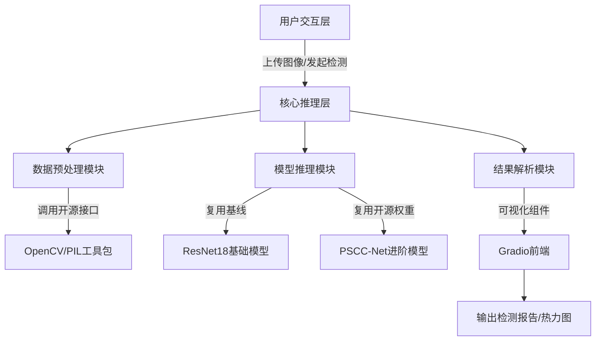

# 图像篡改检测学习研究项目产品方案
## 一、项目概述
### 1.1 项目定位
本项目为**短周期学习研究类项目**，聚焦图像篡改检测核心技术流程，以“复用成熟框架、全员参与实战、快速落地验证”为核心原则，在2周时间内完成从数据准备到轻量系统搭建的全流程实践。项目成果将作为团队CV技术实战案例，同时为后续相关研究或大模型项目积累可复用的基础模块。

### 1.2 核心约束
- 时间周期：14天（2周），含工作日与周末碎片时间；
- 团队配置：10人，均为兼顾工作/学习的学习者，每人累计投入36小时；
- 核心要求：复用开源基础框架，覆盖“数据-模型-部署”全流程，确保全员参与并掌握核心环节。

### 1.3 项目目标
1.  **技术目标**：完成“篡改/真实”二分类检测，支持拼接、复制移动两类核心篡改类型识别，基础模型准确率≥80%，进阶模型准确率≥85%；实现篡改区域初步定位（IoU≥0.65）。
2.  **学习目标**：全员掌握数据预处理、模型微调、轻量部署全流程；每人深度参与1个核心模块，形成实战笔记。
3.  **成果目标**：输出1套轻量检测系统、5份模块实战报告、1份项目总结文档。

## 二、核心功能与产品架构
### 2.1 核心功能（轻量化聚焦）
| 功能模块         | 具体描述                                                                 | 复用依据                          |
|------------------|--------------------------------------------------------------------------|-----------------------------------|
| 图像上传与解析   | 支持JPG/PNG格式上传，自动完成尺寸适配与格式转换，输出标准化图像数据。     | 复用OpenCV/PIL开源图像处理接口    |
| 二分类检测       | 输入图像后输出“真实/篡改”标签及置信度（保留3位小数），支持批量处理。     | 复用PyTorch预训练模型推理流程     |
| 基础篡改定位     | 对篡改图像输出粗略掩码热力图，标记可疑区域（暂不支持像素级精准定位）。   | 复用PSCC-Net开源定位基线模块      |
| 结果可视化与导出 | 展示检测结果、置信度及定位热力图，支持结果表格与图像导出为PDF报告。      | 复用Gradio前端可视化组件           |
| 多模型对比       | 支持同时加载2种模型（基础+进阶）对比检测结果，输出精度差异数据。         | 复用自定义模型管理脚本            |

### 2.2 产品架构（模块化拼接，降低开发成本）

## 三、技术方案（高复用+短周期适配）
### 3.1 数据集方案（精简高效）
- **选用数据**：PSCC-Net合成数据集精简版（筛选1000张图像，含600张篡改图+400张真实图），聚焦“拼接”“复制移动”两类高频篡改类型；
- **数据划分**：按8:2拆分训练集（800张）、验证集（200张），直接复用数据集自带的掩码标注；
- **预处理策略**：简化为“统一尺寸512×512+RGB通道转换+ImageNet标准化”，复用Albumentations开源增强库实现基础翻转/旋转增强。

### 3.2 模型方案（复用开源基线，快速微调）
| 模型类型   | 选型依据                  | 复用资源                                                                 | 训练周期 |
|------------|---------------------------|--------------------------------------------------------------------------|----------|
| 基础模型   | ResNet18（轻量、快训）    | 复用PyTorch Hub预训练权重，仅微调最后3层全连接层                          | 8-10小时 |
| 进阶模型   | 开源PSCC-Net基线（适配数据集） | 复用GitHub开源PSCC-Net最小化版本代码，修改输入尺寸适配数据集              | 12-15小时 |

### 3.3 核心复用框架清单
| 模块类型         | 复用框架/工具                          | 核心优势                                  | 部署成本 |
|------------------|----------------------------------------|-------------------------------------------|----------|
| 数据处理         | Albumentations、OpenCV                 | 开箱即用，支持批量预处理                  | 1小时    |
| 模型训练         | PyTorch、TorchVision                   | 含预训练权重，支持GPU加速训练             | 2小时    |
| 推理部署         | ONNX Runtime（轻量推理）               | 模型加速，推理延迟<200ms                  | 1小时    |
| 前端可视化       | Gradio（开源Web框架）                  | 30行代码搭建基础界面，支持图像/表格展示   | 1小时    |
| 版本管理         | Git+轻量化文档工具（语雀）             | 多人协作代码管理，实时同步进度            | 0.5小时  |

### 3.4 评估指标（适配短周期目标）
| 任务类型         | 核心指标                | 基础模型目标 | 进阶模型目标 |
|------------------|-------------------------|--------------|--------------|
| 二分类检测       | 准确率（Accuracy）      | ≥80%         | ≥85%         |
| 二分类检测       | F1分数                  | ≥0.78        | ≥0.82        |
| 篡改区域定位     | 交并比（IoU）           | ——           | ≥0.65        |

## 四、实施计划（按天拆分，精准控时）
### 4.1 阶段划分与时间轴（14天）
| 阶段         | 时间节点       | 核心任务                                                                 | 交付物                          |
|--------------|----------------|--------------------------------------------------------------------------|---------------------------------|
| 准备阶段     | 第1-2天        | 1. 分发复用框架包（含环境配置脚本）；2. 数据集精简与划分；3. 10人分工分组；4. 环境联调。 | 环境配置手册、分工表、精简数据集 |
| 基线开发阶段 | 第3-6天（4天） | 1. 数据组完成预处理脚本开发；2. 模型A/B组分别微调ResNet18与PSCC-Net；3. 前端组搭建基础界面。 | 预处理脚本、2个基础模型、前端原型 |
| 集成优化阶段 | 第7-10天（4天）| 1. 集成模型与前端，实现检测流程贯通；2. 测试组设计200条测试用例（含边缘场景）；3. 优化模型推理速度。 | 集成系统、测试用例集、优化后模型 |
| 验收总结阶段 | 第11-14天（4天）| 1. 全员测试系统并提交实战笔记；2. 文档组整理技术手册与总结报告；3. 项目复盘与成果展示。 | 轻量检测系统、10份实战笔记、总结报告 |

### 4.2 10人团队分工（按“36小时/人”精准分配）
| 小组         | 人数 | 核心职责                                                                 | 单人工时分配       | 复用保障措施                          |
|--------------|------|--------------------------------------------------------------------------|--------------------|---------------------------------------|
| 统筹组（PM） | 1人  | 进度把控、跨组协调、风险预判；每日19点组织15分钟站会同步进度。           | 36小时（含站会）   | 提供《每日进度检查表》模板            |
| 数据组       | 2人  | 数据集精简、预处理脚本开发、数据增强代码编写；复用Albumentations库。      | 每人36小时         | 提供开源预处理代码模板                |
| 模型A组      | 2人  | ResNet18模型微调、训练日志记录、精度调优；复用PyTorch预训练权重。        | 每人36小时         | 提供模型训练Colab脚本（含GPU配置）    |
| 模型B组      | 2人  | PSCC-Net基线复用、代码适配、定位功能调试；复用开源GitHub代码。            | 每人36小时         | 提供代码修改标注文档                  |
| 前端组       | 2人  | Gradio界面开发、结果可视化（热力图+表格）、导出功能实现；复用组件库。     | 每人36小时         | 提供界面开发Demo代码                  |
| 测试&文档组  | 1人  | 测试用例设计、系统BUG记录、技术手册与总结报告编写；复用测试模板。         | 36小时             | 提供测试用例与文档模板                |

## 五、风险与应对策略
| 风险类型         | 具体描述                                                                 | 应对措施                                                                 |
|------------------|--------------------------------------------------------------------------|--------------------------------------------------------------------------|
| 技术风险         | 模型训练精度不达标（如ResNet18准确率<75%）；推理速度过慢（>500ms/张）。  | 1. 直接复用预训练权重微调，而非从零训练；2. 采用模型量化（INT8）加速；3. 简化模型结构（如减少全连接层参数）。 |
| 时间风险         | 部分成员因工作/学习延误进度，导致模块集成滞后。                           | 1. 每组设置1名“备份人员”，掌握核心操作；2. 提前2天预留“缓冲期”，用于补全滞后模块；3. 简化非核心功能（如暂不支持批量上传）。 |
| 协作风险         | 复用框架版本不兼容（如PyTorch版本冲突）；代码合并出现冲突。               | 1. 提供统一的“环境配置.yml”文件，强制统一版本；2. 采用Git分支管理（每人1个分支，每日合并至主分支）；3. 文档组同步维护“版本兼容清单”。 |
| 算力风险         | 个人设备无GPU，训练速度过慢。                                             | 1. 提供Google Colab Pro免费试用教程；2. 模型组错峰使用团队共享GPU（如阿里云天池免费算力）；3. 降低训练轮次（从50轮减至30轮）。 |

## 六、预期成果与学习价值
### 6.1 核心成果
1.  **可运行产品**：1套轻量图像篡改检测系统（支持Web访问），含2个模型切换、结果可视化、报告导出功能；
2.  **技术资产**：数据集精简包（1000张标注数据）、4套可复用代码（预处理+2个模型+前端）、1份环境配置手册；
3.  **学习产出**：10份个人实战笔记（含模块开发流程、问题解决记录）、1份项目总结报告（含技术对比分析）。

### 6.2 学习价值
1.  全员掌握“数据预处理→模型微调→轻量部署”核心流程，理解图像篡改检测技术逻辑；
2.  熟悉开源框架复用技巧，降低后续同类项目开发成本；
3.  积累短周期团队协作经验，明确“分工-复用-集成”的高效落地模式。

## 七、核心复用资源包清单（提前准备）
1.  环境配置包：含requirements.txt、conda环境.yml文件、GPU配置教程；
2.  代码模板包：预处理脚本模板、ResNet18/PSCC-Net训练模板、Gradio前端Demo；
3.  数据工具包：数据集精简脚本、标注文件格式转换工具；
4.  文档模板包：实战笔记模板、测试用例模板、项目总结报告模板。