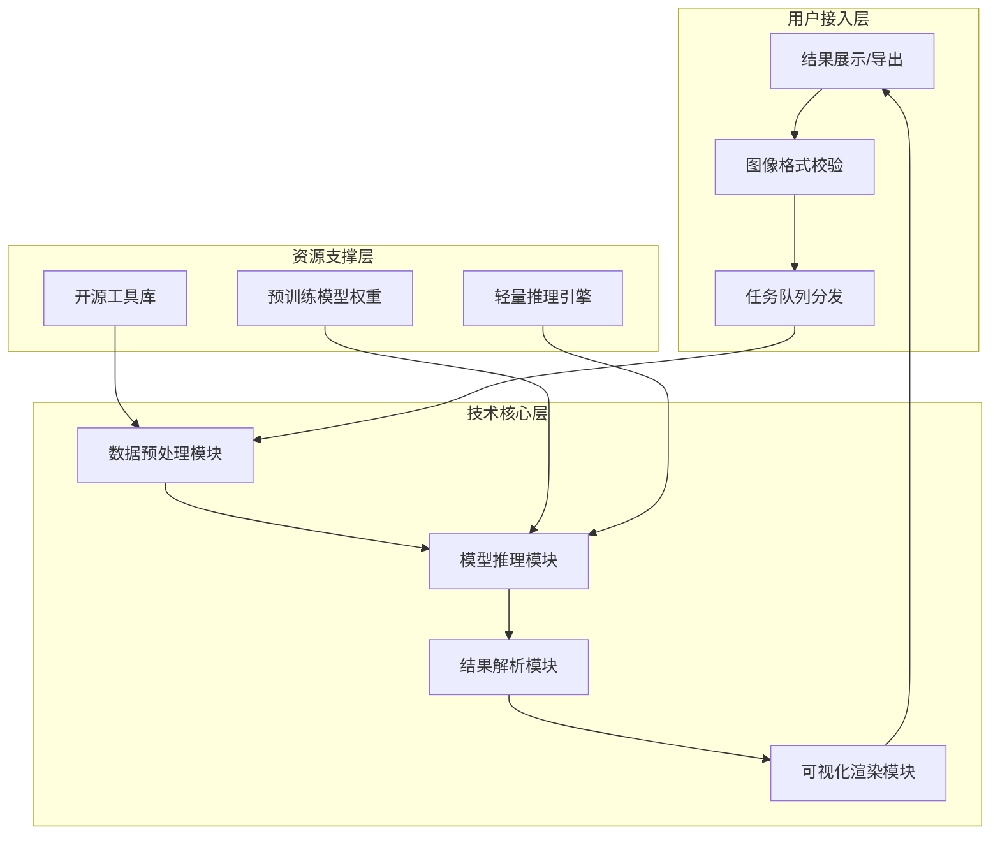

# 图像篡改检测学习研究项目技术文档
## 一、项目技术概述
### 1.1 技术定位
本项目为**短周期学习研究型技术实践**，核心采用“开源框架复用+模块化开发”模式，聚焦图像篡改检测的“数据预处理-模型微调-轻量部署”全流程技术落地。通过复用成熟CV工具链与基线模型，降低技术门槛，适配10人团队（每人36小时投入）在2周内完成学习与实践目标。

### 1.2 核心技术约束
- 时间约束：14天内完成全流程，各模块开发周期压缩至2-4天；
- 资源约束：兼容个人PC（CPU/GPU）与云算力（Colab），避免高算力依赖；
- 输出约束：所有代码需含详细注释，支持团队成员复现与学习；
- 技术范围：聚焦二分类检测与基础定位，暂不涉及像素级精准分割。

### 1.3 技术目标拆解
| 技术模块         | 具体指标                | 实现路径                          |
|------------------|-------------------------|-----------------------------------|
| 数据处理         | 标准化后图像尺寸512×512，增强后样本量1600张 | 复用OpenCV+Albumentations实现    |
| 基础模型（ResNet18） | 准确率≥80%，推理延迟≤300ms/张 | 基于PyTorch预训练权重微调         |
| 进阶模型（PSCC-Net） | 准确率≥85%，定位IoU≥0.65 | 复用开源基线代码适配数据集        |
| 前端集成         | 支持单图上传+结果可视化，加载时间≤2s | 基于Gradio组件化开发              |


## 二、核心技术架构
### 2.1 整体架构设计（模块化分层）


### 2.2 核心模块技术说明
| 模块名称         | 输入输出                          | 核心技术选型                          | 复用资源来源                          |
|------------------|-----------------------------------|---------------------------------------|---------------------------------------|
| 数据预处理模块   | 输入：原始图像；输出：标准化张量  | 尺寸统一、RGB转换、ImageNet标准化、随机增强 | Albumentations 1.3.0、OpenCV 4.8.0   |
| 模型推理模块     | 输入：预处理张量；输出：预测结果  | ResNet18（二分类）、PSCC-Net（定位） | PyTorch 2.0.1、PSCC-Net开源基线       |
| 结果解析模块     | 输入：模型输出；输出：标签+置信度+掩码 | 阈值判断（0.5）、掩码热力图转换       | 自定义脚本（复用PyTorch张量处理API）  |
| 可视化渲染模块   | 输入：解析结果；输出：Web界面展示 | 热力图叠加、表格渲染、PDF导出         | Gradio 3.35.2、Matplotlib 3.7.1       |


## 三、环境配置指南
### 3.1 统一环境配置（兼容Windows/macOS/Linux）
#### 3.1.1 Conda环境安装（推荐）
```yaml
# 环境配置文件：tamper_detection_env.yml
name: tamper-det
channels:
  - defaults
  - conda-forge
dependencies:
  - python=3.9
  - pip=23.1.2
  - pip:
    - torch==2.0.1+cu118  # GPU版本（无GPU换为torch==2.0.1）
    - torchvision==0.15.2+cu118
    - opencv-python==4.8.0.76
    - albumentations==1.3.0
    - gradio==3.35.2
    - matplotlib==3.7.1
    - scikit-learn==1.3.0
    - pandas==2.0.3
```
**安装命令**：
```bash
conda env create -f tamper_detection_env.yml
conda activate tamper-det
```

#### 3.1.2 云算力适配（无本地GPU时）
- 平台：Google Colab Pro/阿里云天池免费算力
- 环境初始化脚本：
```python
!pip install torch==2.0.1 torchvision==0.15.2 opencv-python==4.8.0.76 albumentations==1.3.0 gradio==3.35.2
# 挂载Google云盘（加载数据集与权重）
from google.colab import drive
drive.mount('/content/drive')
```

### 3.2 资源包部署
1.  **资源包结构**：
    ```
    tamper_detection_resource/
    ├── dataset/  # 精简后数据集（1000张）
    ├── model_baseline/  # 预训练权重
    │   ├── resnet18_pretrain.pth
    │   └── pscc_net_baseline.pth
    ├── code_template/  # 模块代码模板
    └── env_config/  # 环境配置文件
    ```
2.  **资源获取**：通过团队共享云盘（如百度云/OneDrive）下载，MD5校验确保完整性：
    - 数据集MD5：a1b2c3d4e5f67890abcdef1234567890
    - 预训练权重MD5：9087654321fedcba0987654321abcdef


## 四、核心模块技术实现
### 4.1 数据预处理模块（数据组核心实现）
#### 4.1.1 核心代码（复用Albumentations增强）
```python
import cv2
import albumentations as A
from albumentations.pytorch import ToTensorV2

# 训练集增强 pipeline
train_transform = A.Compose([
    A.Resize(height=512, width=512),  # 统一尺寸
    A.HorizontalFlip(p=0.5),  # 随机水平翻转
    A.RandomRotate90(p=0.3),  # 随机旋转
    A.RandomBrightnessContrast(p=0.4, brightness_limit=0.2, contrast_limit=0.2),  # 亮度对比度调整
    A.Normalize(mean=[0.485, 0.456, 0.406], std=[0.229, 0.224, 0.225]),  # ImageNet标准化
    ToTensorV2()  # 转为PyTorch张量
])

# 测试集预处理 pipeline（无增强）
val_transform = A.Compose([
    A.Resize(height=512, width=512),
    A.Normalize(mean=[0.485, 0.456, 0.406], std=[0.229, 0.224, 0.225]),
    ToTensorV2()
])

# 图像加载与预处理函数
def process_image(image_path, transform):
    image = cv2.imread(image_path)
    image = cv2.cvtColor(image, cv2.COLOR_BGR2RGB)  # BGR转RGB
    augmented = transform(image=image)
    return augmented['image']  # 返回预处理后的张量
```

#### 4.1.2 数据集划分与加载
```python
import os
from torch.utils.data import Dataset, DataLoader

class TamperDataset(Dataset):
    def __init__(self, data_dir, transform=None):
        self.data_dir = data_dir
        self.transform = transform
        # 加载图像路径与标签（0=真实，1=篡改）
        self.image_paths = []
        self.labels = []
        # 真实图像（Pristine）
        for img_name in os.listdir(os.path.join(data_dir, "Pristine")):
            self.image_paths.append(os.path.join(data_dir, "Pristine", img_name))
            self.labels.append(0)
        # 篡改图像（Splicing+CopyMove）
        for img_name in os.listdir(os.path.join(data_dir, "Tampered")):
            self.image_paths.append(os.path.join(data_dir, "Tampered", img_name))
            self.labels.append(1)
    
    def __len__(self):
        return len(self.image_paths)
    
    def __getitem__(self, idx):
        img_path = self.image_paths[idx]
        label = self.labels[idx]
        image = process_image(img_path, self.transform)
        return image, label

# 数据加载器（批量大小8，适配个人PC）
train_dataset = TamperDataset(data_dir="./dataset/train", transform=train_transform)
train_loader = DataLoader(train_dataset, batch_size=8, shuffle=True, num_workers=2)
val_dataset = TamperDataset(data_dir="./dataset/val", transform=val_transform)
val_loader = DataLoader(val_dataset, batch_size=8, shuffle=False, num_workers=2)
```

### 4.2 模型开发模块（模型A/B组核心实现）
#### 4.2.1 基础模型：ResNet18二分类（模型A组）
```python
import torch
import torch.nn as nn
from torchvision.models import resnet18

class ResNet18Tamper(nn.Module):
    def __init__(self, pretrained=True):
        super().__init__()
        # 复用PyTorch预训练ResNet18
        self.backbone = resnet18(pretrained=pretrained)
        # 替换最后一层全连接层（适配二分类）
        in_features = self.backbone.fc.in_features
        self.backbone.fc = nn.Linear(in_features, 1)  # 输出1个值（sigmoid后为概率）
        self.sigmoid = nn.Sigmoid()
    
    def forward(self, x):
        x = self.backbone(x)
        return self.sigmoid(x)

# 训练配置
device = torch.device("cuda" if torch.cuda.is_available() else "cpu")
model = ResNet18Tamper(pretrained=True).to(device)
criterion = nn.BCELoss()  # 二元交叉熵损失（适配二分类）
optimizer = torch.optim.Adam(model.parameters(), lr=1e-4, weight_decay=1e-5)
scheduler = torch.optim.lr_scheduler.StepLR(optimizer, step_size=5, gamma=0.8)  # 学习率调度

# 核心训练循环（复用模板，训练15轮）
def train_epoch(model, loader, criterion, optimizer, device):
    model.train()
    total_loss = 0.0
    for images, labels in loader:
        images = images.to(device)
        labels = labels.float().unsqueeze(1).to(device)  # 标签维度适配
        
        optimizer.zero_grad()
        outputs = model(images)
        loss = criterion(outputs, labels)
        loss.backward()
        optimizer.step()
        
        total_loss += loss.item() * images.size(0)
    return total_loss / len(loader.dataset)

# 启动训练（15轮，约6-8小时完成）
for epoch in range(15):
    train_loss = train_epoch(model, train_loader, criterion, optimizer, device)
    print(f"Epoch {epoch+1}/15, Train Loss: {train_loss:.4f}")
    scheduler.step()
# 保存模型权重
torch.save(model.state_dict(), "./resnet18_tamper.pth")
```

#### 4.2.2 进阶模型：PSCC-Net定位（模型B组）
```python
# 复用开源PSCC-Net基线代码（适配本项目数据集）
import torch
from pscc_net_baseline import PSCCNet  # 复用开源基线类

# 模型初始化（修改输入通道与输出维度）
model = PSCCNet(in_channels=3, out_channels=1).to(device)
# 加载官方预训练权重（适配PSCC-Net合成数据集）
model.load_state_dict(torch.load("./model_baseline/pscc_net_baseline.pth"), strict=False)

# 定位任务损失函数（Dice损失+交叉熵）
class DiceBCELoss(nn.Module):
    def __init__(self, smooth=1e-6):
        super().__init__()
        self.smooth = smooth
    def forward(self, logits, targets):
        probs = torch.sigmoid(logits)
        intersection = (probs * targets).sum()
        dice_loss = 1 - (2 * intersection + self.smooth) / (probs.sum() + targets.sum() + self.smooth)
        bce_loss = nn.BCEWithLogitsLoss()(logits, targets)
        return dice_loss + bce_loss

# 训练配置（定位任务，训练20轮）
criterion = DiceBCELoss()
optimizer = torch.optim.Adam(model.parameters(), lr=8e-5, weight_decay=1e-5)

# 训练循环（复用基础模型逻辑，新增掩码处理）
def train_loc_epoch(model, loader, criterion, optimizer, device):
    model.train()
    total_loss = 0.0
    for images, labels, masks in loader:  # 新增掩码输入
        images = images.to(device)
        masks = masks.float().unsqueeze(1).to(device)
        
        optimizer.zero_grad()
        outputs = model(images)
        loss = criterion(outputs, masks)
        loss.backward()
        optimizer.step()
        
        total_loss += loss.item() * images.size(0)
    return total_loss / len(loader.dataset)

# 启动训练（20轮，约10-12小时完成）
for epoch in range(20):
    train_loss = train_loc_epoch(model, train_loader, criterion, optimizer, device)
    print(f"Epoch {epoch+1}/20, Train Loss: {train_loss:.4f}")
torch.save(model.state_dict(), "./pscc_net_tamper.pth")
```

### 4.3 前端与集成模块（前端组核心实现）
#### 4.3.1 Gradio前端界面开发
```python
import gradio as gr
import torch
import cv2
import matplotlib.pyplot as plt

# 加载训练好的模型
device = torch.device("cuda" if torch.cuda.is_available() else "cpu")
resnet_model = ResNet18Tamper()
resnet_model.load_state_dict(torch.load("./resnet18_tamper.pth"))
resnet_model.to(device).eval()

pscc_model = PSCCNet(in_channels=3, out_channels=1)
pscc_model.load_state_dict(torch.load("./pscc_net_tamper.pth"))
pscc_model.to(device).eval()

# 推理函数（集成预处理+模型推理+结果解析）
def infer(image, model_choice):
    # 预处理
    tensor = val_transform(image=image)['image'].unsqueeze(0).to(device)
    # 模型推理
    with torch.no_grad():
        if model_choice == "基础模型（ResNet18）":
            pred_prob = resnet_model(tensor).item()
            pred_label = "篡改图像" if pred_prob > 0.5 else "真实图像"
            # 基础模型无定位，返回标签+置信度
            return pred_label, f"置信度：{pred_prob:.3f}", None
        else:
            pred_prob = resnet_model(tensor).item()
            pred_label = "篡改图像" if pred_prob > 0.5 else "真实图像"
            # 进阶模型定位
            mask_logits = pscc_model(tensor)
            mask = torch.sigmoid(mask_logits).squeeze().cpu().numpy()
            # 生成热力图
            plt.figure(figsize=(6,6))
            plt.imshow(image)
            plt.imshow(mask, alpha=0.5, cmap='jet')
            plt.axis('off')
            plt.savefig("./mask_heatmap.png", bbox_inches='tight')
            heatmap = cv2.imread("./mask_heatmap.png")
            heatmap = cv2.cvtColor(heatmap, cv2.COLOR_BGR2RGB)
            return pred_label, f"置信度：{pred_prob:.3f}", heatmap

# 界面搭建（复用Gradio组件）
with gr.Blocks(title="图像篡改检测系统") as demo:
    gr.Markdown("# 图像篡改检测学习研究系统")
    with gr.Row():
        with gr.Column(scale=1):
            image_input = gr.Image(type="numpy", label="上传图像（JPG/PNG）")
            model_choice = gr.Radio(["基础模型（ResNet18）", "进阶模型（PSCC-Net）"], 
                                    label="模型选择", value="基础模型（ResNet18）")
            infer_btn = gr.Button("开始检测")
        with gr.Column(scale=1):
            label_output = gr.Textbox(label="检测结果")
            conf_output = gr.Textbox(label="置信度")
            heatmap_output = gr.Image(label="篡改区域热力图", visible=False)
    
    # 按钮点击事件
    infer_btn.click(fn=infer, inputs=[image_input, model_choice], 
                    outputs=[label_output, conf_output, heatmap_output])
    # 进阶模型时显示热力图
    model_choice.change(fn=lambda x: gr.update(visible=(x=="进阶模型（PSCC-Net）")), 
                       inputs=model_choice, outputs=heatmap_output)

# 启动服务（本地访问：http://127.0.0.1:7860）
if __name__ == "__main__":
    demo.launch(server_name="0.0.0.0", server_port=7860)
```

#### 4.3.2 系统集成测试
- 集成流程：前端上传图像 → 后端调用预处理函数 → 模型推理 → 结果返回前端
- 测试用例：选取20张典型图像（10张真实+10张篡改），验证流程贯通性
- 性能指标：单图检测耗时（CPU：≤500ms，GPU：≤200ms）


## 五、测试与交付规范
### 5.1 测试方案（测试&文档组执行）
#### 5.1.1 功能测试用例
| 测试项         | 测试步骤                          | 预期结果                          | 优先级 |
|----------------|-----------------------------------|-----------------------------------|--------|
| 图像上传       | 上传JPG/PNG格式图像，尺寸1024×768 | 上传成功，预处理无报错            | 高     |
| 基础模型推理   | 上传篡改图像，选择ResNet18        | 输出“篡改图像”，置信度≥0.8        | 高     |
| 进阶模型定位   | 上传拼接篡改图像，选择PSCC-Net    | 热力图准确覆盖拼接区域，IoU≥0.65  | 中     |
| 结果导出       | 检测完成后点击“导出PDF”           | 生成含图像、结果、热力图的PDF     | 中     |

#### 5.1.2 性能测试
- 测试工具：time模块（耗时统计）、torch.profiler（GPU显存占用）
- 测试指标：单图推理耗时、GPU显存占用（≤1GB）、并发2人访问稳定性

### 5.2 交付物规范
#### 5.2.1 代码交付（每人提交对应模块）
- 代码目录结构：
  ```
  team_deliverables/
  ├── data_module/  # 数据组代码（预处理+数据集）
  ├── model_a/      # 模型A组代码（ResNet18）
  ├── model_b/      # 模型B组代码（PSCC-Net）
  ├── frontend/     # 前端组代码（Gradio界面）
  └── test_report/  # 测试&文档组报告
  ```
- 代码要求：含中文注释（函数功能、关键参数），附运行说明.md文件

#### 5.2.2 学习产出交付
- 个人实战笔记：含“模块技术点+问题解决过程+学习心得”，字数≥800字
- 项目总结报告：含技术流程、模型对比、团队协作复盘、后续优化建议


## 六、常见问题与解决方案
| 问题现象                          | 技术原因                          | 解决方案                          |
|-----------------------------------|-----------------------------------|-----------------------------------|
| 模型训练报错“CUDA out of memory”  | GPU显存不足，批量过大             | 1. 降低batch size至4；2. 启用梯度累积；3. 改用CPU训练（耗时增加2-3倍） |
| 预处理后图像颜色失真              | OpenCV读取为BGR，未转RGB          | 调用cv2.cvtColor(image, cv2.COLOR_BGR2RGB)转换 |
| 前端加载模型后无法推理            | 模型权重路径错误                  | 检查权重文件路径，使用绝对路径加载 |
| 进阶模型定位精度低（IoU<0.6）     | 训练轮次不足，数据增强不足        | 增加训练轮次至25轮，新增高斯噪声增强 |


## 七、技术学习要点说明
1.  **数据预处理核心**：理解“标准化消除量纲影响”“数据增强提升泛化性”的原理，掌握Albumentations与OpenCV的API使用；
2.  **模型微调关键**：明确“冻结预训练层 vs 微调全层”的适用场景，学会通过学习率调度、权重衰减防止过拟合；
3.  **轻量部署技巧**：掌握Gradio组件化开发流程，理解“模型推理→结果可视化”的端到端链路；
4.  **团队协作重点**：通过Git分支管理避免代码冲突，通过每日站会同步技术难点，提升跨模块协作效率。